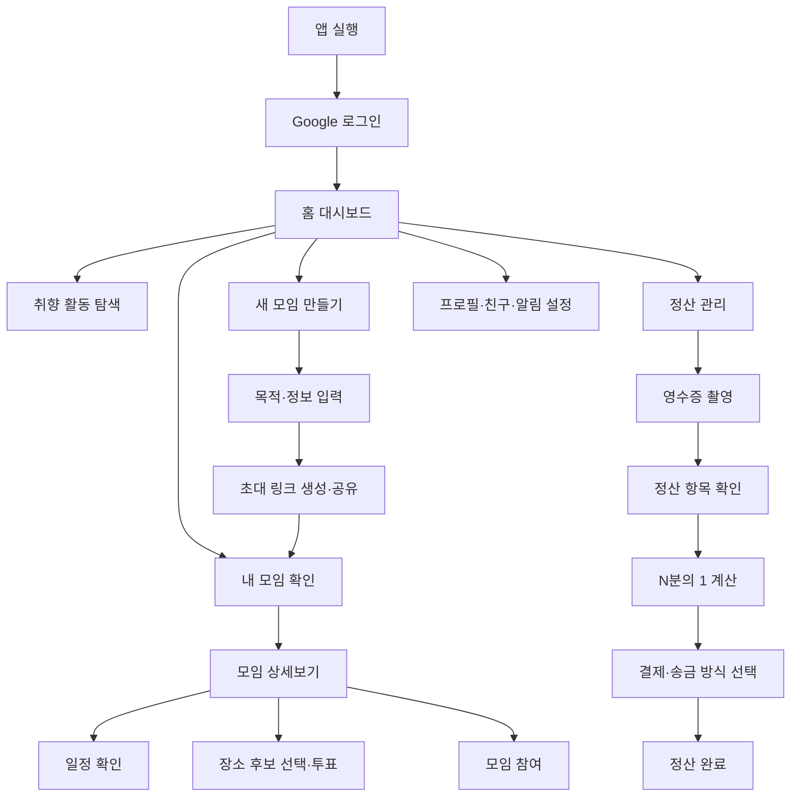

# 🤝 모여라 (Moyora) — 모임 관리 올인원 웹앱

> 장소 추천부터 일정 조율, 모임 초대, N차 정산까지 복잡한 모임 준비를 한곳에서 해결하는 모바일 중심 웹앱

<p>
  
  
  
  
  
  
</p>

## 🔗 프로젝트 링크

| 구분 | 링크 |
|---|---|
| 🚀 배포 사이트 | [moyora01-app.vercel.app](https://moyora01-app.vercel.app/) |
| 💻 GitHub | [ltn3515-ui/moyora01_app](https://github.com/ltn3515-ui/moyora01_app) |
| 📝 Notion 기획서 | [모여라 프로젝트 기획서](https://proud-syrup-039.notion.site/3d406f8b2220805cb394dd6977243451?source=copy_link) |

## 🖼️ 주요 화면

<table>
  <tr>
    <th>홈 화면</th>
    <th>모임 상세 화면</th>
    <th>모임 관리 모달</th>
  </tr>
  <tr>
    <td></td>
    <td></td>
    <td></td>
  </tr>
</table>

## 💡 기획 배경

모임을 준비할 때는 단체 채팅방 안에서 날짜를 다시 확인하고, 각자의 출발지를 비교해 장소를 정하고, 영수증을 보며 비용을 계산한 뒤 미입금자에게 다시 연락해야 합니다. 모여라는 흩어진 과정을 하나의 사용자 흐름으로 연결해 모임장의 반복 업무와 참여자의 피로를 줄이기 위해 기획했습니다.

### 핵심 문제

- 여러 사람의 일정과 장소를 한 번에 결정하기 어렵습니다.
- 앱을 설치하지 않은 사람을 모임에 초대하기 번거롭습니다.
- 영수증 확인, N분의 1 계산, 입금 확인이 서로 분리되어 있습니다.
- 모임 정보와 지난 활동 기록이 단체 채팅방에 흩어집니다.

### 해결 방향

`모임 생성 → 초대 → 일정·장소 결정 → 참여 → 정산 → 활동 기록`을 하나의 모바일 경험으로 연결합니다.

## ✨ 주요 기능 & 인터랙션

### 1. Google 로그인과 사용자 상태 관리

Firebase Authentication을 이용한 Google 로그인 흐름을 구성했습니다. 로그인한 사용자의 이름, 이메일과 프로필 이미지를 앱 상태에 반영하며 로그아웃과 인증 상태 변경도 처리합니다.

### 2. 취향 기반 활동 탐색과 홈 대시보드

홈에서 친구 활동, 취향 저격 콘텐츠, 날짜 확인, 다가오는 이벤트와 공유 콘텐츠를 빠르게 확인할 수 있습니다. 주요 기능은 모달로 열려 화면 이동을 줄이고 모바일 환경에서도 맥락을 유지하도록 설계했습니다.

### 3. 모임 생성과 초대 링크

독서, 친목, 번개, 취미 등 모임 목적을 선택하거나 직접 입력해 모임을 만들 수 있습니다. 생성과 동시에 초대 링크를 복사할 수 있어 앱을 설치하지 않은 사용자도 링크를 통해 참여할 수 있는 흐름을 제공합니다.

### 4. 모임 상세 정보와 장소 투표

모임 일정, 장소, 개설자, 참가비, 운영시간과 참여 멤버를 한 화면에서 확인합니다. Google 지도 기반 장소 확인, 후보 장소 선택과 투표용 모달을 통해 단체 채팅방에서 반복되던 장소 결정을 앱 안으로 가져왔습니다.

### 5. 영수증 기반 N분의 1 정산

영수증 촬영 화면, 정산 항목 관리, 분할 계산기와 정산 상세 화면을 연결했습니다. 현재 MVP에서는 영수증 촬영과 OCR 정산의 사용자 흐름 및 인터페이스를 구현했으며, 실제 OCR API 자동 인식은 확장 연동 항목입니다.

### 6. 간편결제 및 송금 흐름

대표 수령 계좌를 관리하고 토스페이, 카카오페이 또는 직접 송금 방식을 선택할 수 있도록 구성했습니다. Toss Payments SDK와 결제 성공·실패 라우트를 포함해 결제 결과에 따른 화면 흐름을 분리했습니다.

### 7. 친구·프로필·알림·활동 기록

친구 목록과 검색, 프로필 수정, 저장된 순간, 알림 확인, 계좌 및 환경 설정 기능을 제공합니다. 공통 Context에서 프로필, 모임, 친구, 정산, 알림과 설정 상태를 관리합니다.

## 🧭 사용자 플로우



## 🗂️ 폴더 구조

```text
moyora01_app/
├── api/
│   └── auth/
│       └── google.ts                 # Google 인증 API
├── public/                           # 브라우저에서 사용하는 정적 리소스
│   └── assets/                       # 활동·프로필·로고·결제 이미지
├── src/
│   ├── assets/                       # React에서 import하는 이미지 에셋
│   ├── components/
│   │   ├── Layout.tsx                # 공통 모바일 레이아웃
│   │   ├── Header.tsx                # 공통 헤더
│   │   ├── Footer.tsx                # 하단 내비게이션
│   │   ├── CustomCursor.tsx          # 데스크톱 커서 인터랙션
│   │   ├── Toast.tsx                 # 상태 안내 토스트
│   │   ├── Map/
│   │   │   └── GoogleMapView.tsx     # Google 지도 화면
│   │   └── Modal/                    # 검색·모임·지도·정산 등 모달
│   ├── context/
│   │   └── AppContext.tsx            # 앱 전역 상태와 액션 관리
│   ├── firebase/
│   │   └── firebaseConfig.ts         # Firebase 초기화 및 인증 설정
│   ├── pages/
│   │   ├── Splash.tsx                # 시작 화면
│   │   ├── Login.tsx                 # 로그인
│   │   ├── Home.tsx                  # 홈 대시보드
│   │   ├── Friends.tsx               # 친구 목록
│   │   ├── Groups.tsx                # 내 모임
│   │   ├── NewCru.tsx                # 새 모임 생성
│   │   ├── Calculate.tsx             # 정산 관리
│   │   ├── Profile.tsx               # 내 정보
│   │   ├── Option.tsx                # 환경 설정
│   │   ├── Account.tsx               # 대표 계좌 관리
│   │   └── payment/
│   │       ├── Success.tsx            # 결제 성공
│   │       └── Fail.tsx               # 결제 실패
│   ├── styles/
│   │   ├── GlobalStyle.ts            # 전역 스타일
│   │   ├── Theme.ts                  # 디자인 토큰과 컬러 테마
│   │   └── styled.d.ts               # styled-components 타입 선언
│   ├── types/
│   │   └── index.ts                  # 공통 TypeScript 타입
│   ├── App.tsx                       # Provider 및 라우트 구성
│   └── main.tsx                      # React 진입점
├── purblishing/org/                  # 기존 HTML·CSS·JS 퍼블리싱 원본
├── 디자인시안/                       # 초기 UI 디자인 시안
├── .env.example                      # 환경 변수 예시
├── index.html                        # Vite 진입 HTML
├── package.json                      # 스크립트와 의존성
├── tsconfig.json                     # TypeScript 설정
└── vite.config.ts                    # Vite 설정
```

<details>
  <summary><strong>GitHub 저장소 구조 캡처 보기</strong></summary>
  <br />
  
</details>

## 🛠️ 기술 스택

| 구분 | 기술 | 활용 내용 |
|---|---|---|
| Frontend | React 19, TypeScript | 컴포넌트 기반 SPA와 타입 안정성 |
| Build | Vite 8 | 개발 서버 및 프로덕션 빌드 |
| Routing | React Router DOM | 화면·결제 결과 라우팅 |
| Styling | styled-components | 공통 테마와 컴포넌트 스타일 |
| State | React Context API | 프로필·모임·친구·정산·알림 상태 |
| Auth | Firebase Authentication | Google 로그인과 인증 상태 처리 |
| Map | Google Maps | 모임 장소 표시와 선택 흐름 |
| Payment | Toss Payments SDK | 결제 요청 및 성공·실패 화면 |
| Deploy | Vercel | 웹앱 빌드 및 배포 |

## 🤖 AI 활용 프로세스

이 프로젝트에서는 AI를 완성 결과를 대신 만드는 도구가 아니라, 기획과 디자인, 개발의 초안을 빠르게 만들고 사람이 검증·수정하는 협업 도구로 활용했습니다.

### ① 기획 — 문제 정의와 기능 우선순위

모임장이 반복해서 겪는 일정 조율, 장소 결정, 정산과 미입금 확인 문제를 정리하고 사용자 페르소나, 경쟁 서비스와 MVP 기능의 초안을 만드는 데 AI를 활용했습니다.

> “모임 준비 과정에서 반복되는 불편을 사용자·모임장 관점으로 나누고, 반드시 해결해야 할 MVP 기능을 우선순위로 정리해줘.”

AI가 제안한 기능을 모두 넣지 않고, `초대 링크 · 장소 결정 · 영수증 정산`처럼 모임 전후의 실제 불편과 직접 연결되는 기능을 중심으로 범위를 조정했습니다.

### ② UX/UI — 화면 구조와 문구 검토

사용자 플로우와 화면 목록을 먼저 정리한 뒤, Stitch와 Figma로 모바일 화면을 설계했습니다. 버튼 문구, 빈 상태, 오류 안내와 모달의 정보 순서를 비교하는 과정에서 AI의 여러 제안을 받아 직접 선택하고 수정했습니다.

### ③ 개발 — React·TypeScript 마이그레이션

기존 HTML·CSS·JavaScript 퍼블리싱 결과물을 React, TypeScript와 styled-components 구조로 전환할 때 컴포넌트 분리와 타입 정의의 초안을 AI로 생성했습니다.

> “중복된 헤더, 하단 내비게이션과 모달을 재사용 가능한 React 컴포넌트로 분리하고, 화면 데이터를 TypeScript 인터페이스로 정의해줘.”

생성된 코드는 실제 라우팅과 상태 흐름에 맞춰 다시 연결하고, 빌드 과정에서 발생한 타입 오류와 미사용 코드를 직접 검토해 수정했습니다.

### ④ 기능 구현 — 인증·지도·정산 흐름

Firebase Google 로그인, 지도 컴포넌트, 초대 링크, N분의 1 계산과 결제 화면의 기본 로직을 구현할 때 AI로 코드 초안과 오류 원인 후보를 얻었습니다. API 키와 환경 변수는 코드에 직접 넣지 않고 `.env`에서 관리하도록 분리했습니다.

### ⑤ AI 기능 확장 — 장소 추천과 영수증 OCR

AI 장소 추천 모달과 영수증 촬영·OCR 정산 흐름을 UI로 설계했습니다. 현재 MVP에서는 사용자 흐름과 인터페이스를 검증하는 단계이며, 실제 추천 모델과 OCR API 연동은 다음 개발 단계에서 진행할 수 있도록 구조를 분리했습니다.

## 🩹 트러블슈팅

| 이슈 | 원인 | 해결 |
|---|---|---|
| Vercel 빌드 시 TypeScript 오류 | `null` 값으로 객체 인덱스 접근 및 미사용 import | 조건문과 타입 가드 추가, 미사용 코드 제거 후 빌드 검증 |
| Google 로그인이 배포 환경에서 동작하지 않음 | Firebase 승인 도메인과 OAuth 리디렉션 설정 불일치 | Vercel 도메인 등록 및 인증 설정 분리 |
| 새로고침 후 잘못된 경로 표시 | SPA 라우팅과 배포 경로 처리 문제 | 존재하지 않는 경로를 시작 화면으로 리디렉트 |
| 모달이 많아지며 상태 관리가 복잡해짐 | 화면별 로컬 상태와 공통 데이터 혼재 | 공통 데이터는 Context, 화면 표시 상태는 컴포넌트 단위로 분리 |
| 이미지 자산 경로가 환경별로 달라짐 | 기존 퍼블리싱 경로와 Vite 에셋 처리 방식 차이 | 정적 파일과 import 에셋의 용도를 구분해 정리 |

## 🚀 로컬 실행 방법

```bash
# 저장소 복제
git clone https://github.com/ltn3515-ui/moyora01_app.git

# 프로젝트 폴더 이동
cd moyora01_app

# 패키지 설치
npm install

# 환경 변수 파일 생성
cp .env.example .env

# 개발 서버 실행
npm run dev
```

`.env` 파일에 자신의 Firebase 프로젝트 정보를 입력해야 Google 로그인이 정상적으로 동작합니다.

```env
VITE_FIREBASE_API_KEY=your_api_key_here
VITE_FIREBASE_AUTH_DOMAIN=your_project_id.firebaseapp.com
VITE_FIREBASE_PROJECT_ID=your_project_id
VITE_FIREBASE_STORAGE_BUCKET=your_project_id.appspot.com
VITE_FIREBASE_MESSAGING_SENDER_ID=your_messaging_sender_id
VITE_FIREBASE_APP_ID=your_app_id
```

## 📌 향후 개선 계획

- 실제 OCR API를 연결한 영수증 자동 인식
- 대중교통 소요시간 기반 중간지점 계산
- 실시간 일정 투표와 최종 일정 확정
- 카카오톡 딥링크 기반 초대와 미수금 알림
- Firestore 기반 모임·정산 데이터 영속화
- AI 장소 추천의 실제 검색 데이터 연동

## 👤 담당 업무

- 서비스 기획 및 사용자 문제 정의
- 사용자 플로우·와이어프레임·UI 디자인
- React·TypeScript 프론트엔드 구현
- Firebase 인증 및 외부 서비스 연결
- GitHub 형상관리와 Vercel 배포
- AI 바이브코딩을 활용한 코드 생성·검증·트러블슈팅

## 📄 라이선스

본 프로젝트는 포트폴리오 및 학습 목적으로 제작되었습니다.
