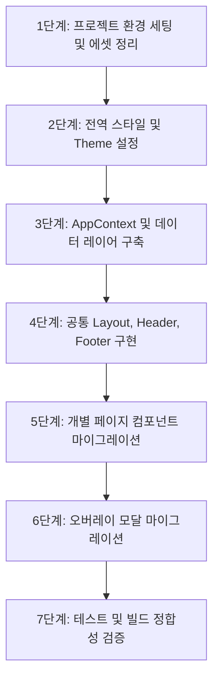

# '모여라' 웹 리소스의 React (Vite + TypeScript) 변환 작업계획서

본 문서는 기존에 퍼블리싱된 Vanilla HTML/CSS/JS 프로젝트('모여라')를 React, Vite, TypeScript, Styled-components 기반의 최신 모바일 웹 SPA 프로젝트로 안전하고 구조적으로 변환하기 위한 마이그레이션 작업 계획서입니다.

---

## 1. 프로젝트 개요

- **프로젝트 경로**: `D:\이태노\project001`
- **원본 리소스 위치**: `purblishing/org/`
- **변환 목표**:
  - 기존 12개 화면(HTML)의 UI/UX와 CSS 스타일을 완벽하게 재현.
  - 리액트 SPA 라우팅을 구축하여 페이지 전환을 유연하게 처리.
  - 전형적인 Vanilla DOM 조작 코드(JS)를 선언형 React 컴포넌트 및 상태 관리(State/Props) 코드로 이식.
  - 중복되는 마크업(헤더, 푸터, 모달 등)을 재사용 가능한 리액트 공통 컴포넌트로 분리.
  - CSS 파일을 CSS-in-JS 라이브러리인 **Styled-components** 코드로 변환하여 스타일 무결성 확보.

### 주요 기술 스택
- **Build Tool**: Vite
- **Library**: React 18, TypeScript
- **Routing**: React Router DOM (v6)
- **Styling**: Styled-components
- **Icons**: FontAwesome SVG Component 또는 Lucide-React / React Icons

---

## 2. 디렉토리 구조 정의 (React + TypeScript)

프로젝트 루트 디렉토리 아래에 다음과 같은 폴더 및 파일 구조를 구축합니다.

```
D:\이태노\project001/
├─ public/                  # 정적 리소스 (공통 파비콘 등)
├─ src/
│  ├─ assets/               # 이미지, 로고, 프로필 아바타 등 에셋 파일 (org/ 내의 png/jpg 이동)
│  ├─ components/           # 공통 및 레이아웃 컴포넌트
│  │  ├─ Layout.tsx         # 전체 레이아웃 (헤더/푸터 영역 고정 및 모바일 480px 제한)
│  │  ├─ Header.tsx         # 공통 헤더 컴포넌트 (페이지별 타이틀, 알림, 뒤로가기 동적 렌더링)
│  │  ├─ Footer.tsx         # 공통 푸터 (하단 네비게이션 BottomNav 컴포넌트)
│  │  ├─ Common/            # 공통 UI 엘리먼트 (Button, Card, Avatar 등)
│  │  └─ Modal/             # 전역/오버레이 모달 컴포넌트
│  │      ├─ SearchModal.tsx # 검색 (search.html)
│  │      ├─ CameraModal.tsx # 영수증 QR 카메라 (camera.html)
│  │      └─ MemoryModal.tsx # 저장된 순간들 (memory.html)
│  ├─ pages/                # 개별 라우트 페이지 컴포넌트
│  │  ├─ Splash.tsx         # 스플래시 화면 (splash.html)
│  │  ├─ Home.tsx           # 메인 홈 (index.html)
│  │  ├─ Friends.tsx        # 친구 목록 (friends.html)
│  │  ├─ Profile.tsx        # 내 정보 (profile.html)
│  │  ├─ Groups.tsx         # 나의 모임 목록 (add.html)
│  │  ├─ Calculate.tsx      # 정산 관리 (calculate.html)
│  │  ├─ NewCru.tsx         # 신규 모임 생성 (newcru.html)
│  │  ├─ Option.tsx         # 환경 설정 (option.html)
│  │  └─ Account.tsx        # 대표 계좌 관리 (account.html)
│  ├─ context/              # 전역 상태 관리 영역
│  │  └─ AppContext.tsx     # data.js에 대응하는 상태(State) 및 핸들러 API 제공
│  ├─ styles/               # 공통 스타일링 정의
│  │  ├─ GlobalStyle.ts     # common.css 내의 리셋 스타일, 폰트 및 모바일 레이아웃 기본값
│  │  └─ Theme.ts           # 공통 컬러 코드 정의 (yellow, pink, blue, green 등)
│  ├─ types/                # TypeScript 공통 인터페이스 및 타입 정의
│  │  └─ index.ts           # Profile, Friend, Group, Moment 등의 데이터 모델 정의
│  ├─ App.tsx               # 라우터 매핑 및 AppContext Provider 래핑
│  └─ main.tsx              # React 엔트리 파일
├─ index.html               # Vite index.html
├─ package.json
├─ tsconfig.json
└─ vite.config.ts
```

---

## 3. 라우팅 테이블 구성 (react-router-dom)

모든 페이지는 단일 도메인 루트 `/` 경로를 기준으로 매핑하며, `react-router-dom`을 사용해 제어합니다.

| 기존 HTML | 리액트 라우트 경로 | 컴포넌트 파일 | 동작 설명 |
| :--- | :--- | :--- | :--- |
| `splash.html` | `/` (기본값) | `pages/Splash.tsx` | 최초 로딩 화면. 1.5초~2초 유지 후 자동으로 `/home`으로 리다이렉트. |
| `index.html` | `/home` | `pages/Home.tsx` | 대시보드 형태의 메인 홈. |
| `friends.html` | `/friends` | `pages/Friends.tsx` | 친구 리스트 확인. 검색 입력 클릭 시 검색 모달 오픈. |
| `add.html` | `/groups` | `pages/Groups.tsx` | 나의 모임 리스트. '새 모임 만들기' 클릭 시 `/newcru`로 이동. |
| `profile.html` | `/profile` | `pages/Profile.tsx` | 내 정보 확인. 계정설정 클릭 시 `/option` 이동, 저장된 순간들 클릭 시 모달 오픈. |
| `calculate.html` | `/calculate` | `pages/Calculate.tsx` | 정산 현황 및 라인 차트 표시. QR카메라 클릭 시 카메라 모달 오픈. |
| `newcru.html` | `/newcru` | `pages/NewCru.tsx` | 모임 생성을 위한 다단계(Step-by-Step) 입력 폼 페이지. |
| `option.html` | `/option` | `pages/Option.tsx` | 알림 및 언어 설정, 대표 계좌 관리 진입점을 제공하는 설정 화면. |
| `account.html` | `/account` | `pages/Account.tsx` | 정산 수령을 위한 대표 계좌 정보 등록 및 변경 페이지. |

### 오버레이 모달 (Overlay Modals)
이동이 아닌 오버레이 형태로 기존 화면 위에 띄워지는 화면들은 React 상태에 기반한 조건부 컴포넌트로 구현합니다.
1. **검색 모달 (`SearchModal`)**: `/home` 또는 `/friends` 내 검색 영역 클릭 시 전역 상태/로컬 상태를 통해 노출.
2. **카메라 모달 (`CameraModal`)**: `/calculate` 페이지 내 QR 스캔 액션 실행 시 노출.
3. **저장된 순간들 모달 (`MemoryModal`)**: `/profile` 페이지 내 '저장된 순간들' 메뉴 클릭 시 노출.

---

## 4. 핵심 마이그레이션 상세 전략

### 4-1. CSS-in-JS (Styled-components) 적용 규칙
- `common.css`에 선언된 컬러 시스템 토큰을 `styles/Theme.ts`에 객체화하여 리액트 전역으로 주입합니다.
  - 예: `theme.colors.yellow` = `#FEDD13`, `theme.colors.pink` = `#F491BC` 등.
- 모바일 뷰포트의 일관성을 위해 각 페이지 컴포넌트는 `Layout` 안에서 `max-width: 480px; width: 100%; margin: 0 auto; min-height: 100vh; position: relative;` 특성을 가지도록 설정합니다.
- HTML 태그에 입혀져 있던 클래스(`card`, `btn`, `btn-primary` 등)들을 각각 대응하는 Styled Component로 리팩토링합니다.
  - `<div class="card event-item">` $\rightarrow$ `<EventCard>`
  - `<button class="btn btn-primary">` $\rightarrow$ `<Button variant="primary">`

### 4-2. 헤더 및 푸터 공통 컴포넌트화
- **공통 헤더 (`Header`)**:
  - 뒤로가기 버튼 노출 여부, 헤더 타이틀 텍스트, 알림벨 노출 여부 등을 Props(`title`, `showBackButton`, `showBell`)로 수신하여 동적으로 UI를 렌더링하도록 일원화합니다.
- **공통 푸터 (`Footer` / BottomNav)**:
  - `react-router-dom`의 `NavLink`를 사용하여 현재 브라우저 주소(URL)에 맞는 메뉴(`홈`, `친구`, `검색`, `내 모임`, `내 정보`)에 활성 스타일(`is-active` 클래스 효과)을 실시간으로 부여합니다.
  - '검색' 클릭 시 페이지 전환 대신 검색 모달을 여는 동작을 처리하기 위해 NavLink 기본 이벤트를 제어하거나, 검색 클릭 시 전역 모달 상태를 변경하도록 처리합니다.

### 4-3. 데이터 관리 모델(TypeScript) 및 React Context 이식
- `data.js`에 명시된 원본 데이터 객체들을 `types/index.ts`에 TypeScript 인터페이스로 강타입 정의합니다.
- `AppContext`를 작성하여 `myProfile`, `friends`, `myGroups`, `appSettings`, `payoutAccount`, `savedMoments`를 `useState` 상태로 선언합니다.
- 계정 관리의 갱신, 모임의 신규 생성 추가, 순간들의 즐겨찾기 토글 등 기존 JS 파일들의 이벤트 처리 로직들을 State 업데이트 함수로 변경하여, 상태 변화에 따라 화면이 자동으로 다시 그려지도록 React 선언형 구조를 완성합니다.

---

## 5. 단계별 실행 계획



### [1단계] 프로젝트 환경 세팅 및 에셋 정리 (1일차)
- `d:\이태노\project001` 디렉토리에 Vite 프로젝트 생성.
  - `npm create vite@latest ./ -- --template react-ts`
- 필요한 의존성 라이브러리 추가 설치.
  - `npm install styled-components react-router-dom`
  - `npm install -D @types/styled-components`
- `purblishing/org/` 에 들어있는 모든 이미지 에셋(`*.png`)을 React 프로젝트의 `src/assets/` 폴더로 일괄 복사 이동.

### [2단계] 전역 스타일 및 테마 설정 (1일차)
- `src/styles/Theme.ts`에 컬러 변수 선언.
- `src/styles/GlobalStyle.ts`에 기존 `common.css`의 리셋 설정 및 글로벌 모바일 레이아웃 래퍼 스타일 지정.

### [3단계] AppContext 및 데이터 레이어 구축 (2일차)
- TypeScript 인터페이스(`src/types/index.ts`) 선언.
- `src/context/AppContext.tsx`를 생성하고 `data.js`의 초기값을 리액트 상태로 적재. 갱신을 담당할 API 핸들러들 구현.

### [4단계] 공통 Layout, Header, Footer 구현 (2일차)
- 모바일 프레임 레이아웃 컴포넌트(`Layout.tsx`) 제작.
- 공통 헤더(`Header.tsx`) 및 하단 탭 네비게이션(`Footer.tsx`) 제작.

### [5단계] 개별 페이지 컴포넌트 마이그레이션 (3~4일차)
- 개별 `.html` 마크업 $\rightarrow$ React JSX 파일 변환.
- 개별 `.css` 파일 $\rightarrow$ Styled-components 코드 변환.
- 개별 `.js` 파일 $\rightarrow$ React Hook 및 API 연결.
  - *작업 순서*: Splash $\rightarrow$ Home $\rightarrow$ Friends $\rightarrow$ Profile $\rightarrow$ Groups $\rightarrow$ NewCru $\rightarrow$ Calculate $\rightarrow$ Option $\rightarrow$ Account

### [6단계] 오버레이 모달 마이그레이션 (5일차)
- SearchModal, CameraModal, MemoryModal 제작 및 AppContext와의 상태 바인딩.
- 오버레이 활성화 시의 부드러운 애니메이션 효과 styled-components에 적용.

### [7단계] 테스트 및 빌드 정합성 검증 (5일차)
- 전체 페이지별 라우팅 흐름 검증.
- 상태 갱신(계좌 수정, 신규 모임 추가 등)에 따른 리렌더링 정상 동작 확인.
- `npm run build` 명령어 수행을 통해 타입 에러 및 미사용 임포트 등 에러 제로화 확인.
